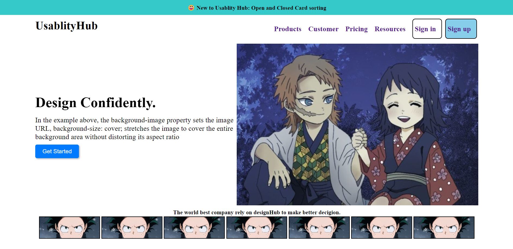
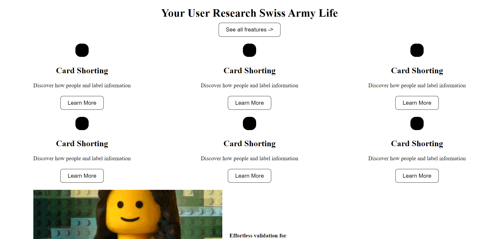
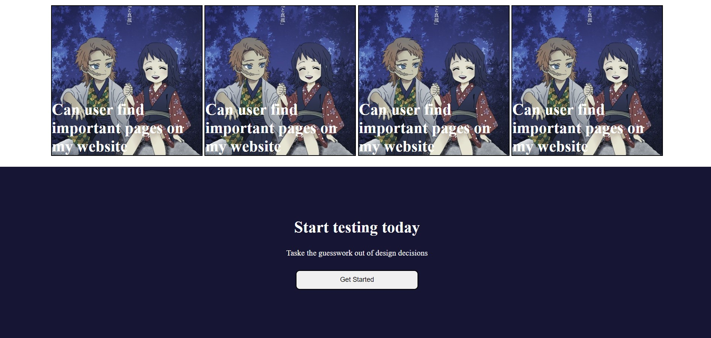
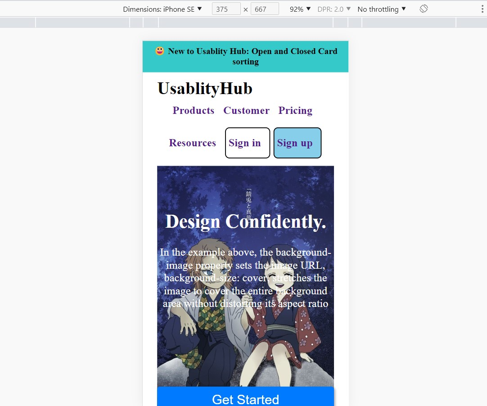

# webdevlopment1-responsibe
**Project Title: Responsive Website using HTML, CSS, Media Queries, and Flexbox**

## Introduction
Welcome to the README section of my project! Here, I will provide a comprehensive overview of my responsive website built with HTML, CSS, media queries, and flexbox. Throughout this document, I will delve into the project's objectives, techniques utilized, and the key features that make my website stand out. So, let's dive in!

## Project Description
Our project focuses on creating a fully responsive website that provides an optimal user experience across various devices and screen sizes. I have employed HTML and CSS as the foundation for structuring and styling the website, while incorporating advanced techniques such as media queries and flexbox to ensure responsiveness.

## Key Features
1. **Responsive Layout:** Our website adapts seamlessly to different screen sizes, including laptops, tablets, and mobile devices. This ensures that users can access and navigate our content comfortably, regardless of the device they are using.

2. **Media Queries:** By employing media queries, we have implemented specific design adjustments for different screen widths. This allows us to tailor the website's appearance and functionality to each device, optimizing the user experience.

3. **Flexbox:** The flexbox layout model has been instrumental in creating flexible and dynamic page structures. By leveraging flex properties, such as `display: flex`, `flex-direction`, and `justify-content`, we have achieved a fluid and visually appealing layout that adapts to varying screen sizes.

4. **Optimized Images:** We have implemented techniques to ensure that images are responsive and optimized for performance. This includes utilizing the `max-width: 100%` CSS property to prevent images from exceeding their container size and utilizing the `srcset` attribute to provide different image sources based on screen resolution.

5. **Testing and Validation:** Our website has undergone rigorous testing and validation to ensure its responsiveness across a range of devices and screen sizes. We have utilized browser developer tools, responsive design testing websites, and real device testing to guarantee a seamless user experience.

## Usage and Installation
To use our responsive website, simply download or clone the project repository. Open the HTML file in any modern web browser, and you will be able to explore the fully functional and responsive website across different devices and screen sizes.

## Development Process
During the development process, we followed a structured approach to ensure a successful outcome. We began by designing the HTML structure, ensuring proper semantic markup for content organization. Next, we applied CSS styling to achieve the desired visual design, incorporating custom fonts, colors, and layouts.

Once the basic layout was in place, we introduced media queries to accommodate different screen sizes and adapt the design accordingly. By defining breakpoints and adjusting styles within these breakpoints, we ensured a smooth transition between various devices.

To achieve flexible and dynamic layouts, we extensively utilized the flexbox model. Through the strategic use of flex properties, we were able to align, distribute, and reflow page elements to create visually appealing designs that respond well to different screen sizes.

Throughout the development process, we continually tested and validated our website across multiple devices and screen sizes. This iterative approach allowed us to identify and resolve any responsiveness issues, ensuring that the website provides an excellent user experience.

# Font page in big screen

# Font page in big screen

# In mobile device

# In mobile device

# In mobile device

